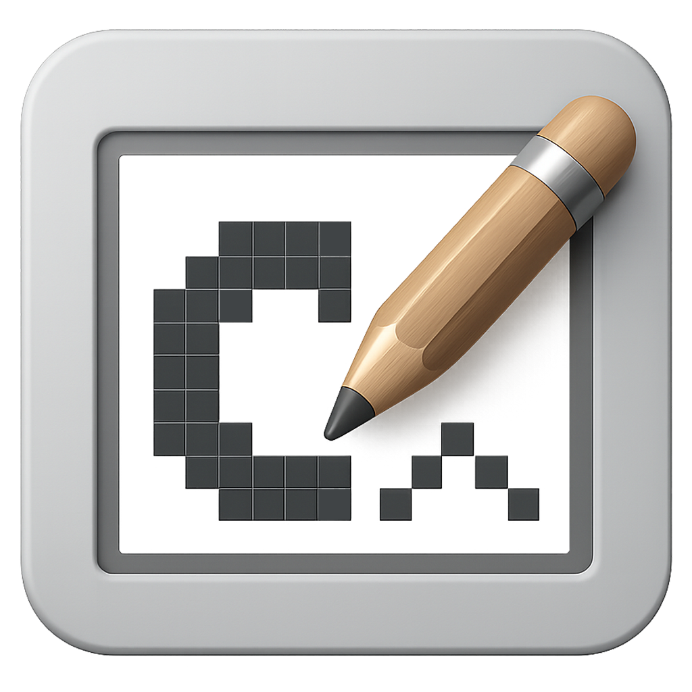

# BitsDraw

[🚀 Launch BitsDraw](https://kurogedelic.github.io/BitsDraw/)

A web-based bitmap editor for creating graphics compatible with U8G2 monochrome displays.

## Features

- **Pixel-perfect editing** with multiple zoom levels
- **Multiple drawing tools**: Pencil, Brush, Eraser, Bucket Fill, Line, Rectangle, Circle, Text, Spray, Eyedropper
- **Selection tools** with copy/paste and drag functionality
- **Pattern support** including dither patterns for artistic effects
- **Real-time preview** at 1:1 scale
- **Windowed interface** with draggable, resizable windows
- **Grid display** toggle for precise pixel placement
- **Undo/Redo** with 50-level history
- **Image import** from PNG/JPG files
- **Export to U8G2** C header format
- **Keyboard shortcuts** for efficient workflow

## Usage

1. Open `index.html` in a web browser
2. Use the tool palette to select drawing tools
3. Click and drag on the canvas to draw
4. Use selection tools to copy/paste regions
5. Export your bitmap as U8G2-compatible C code

## Keyboard Shortcuts

### File Operations
- `Ctrl+N` - New Canvas
- `Ctrl+O` - Open
- `Ctrl+S` - Save
- `Ctrl+E` - Export

### Edit Operations
- `Ctrl+Z/Y` - Undo/Redo
- `Ctrl+A` - Select All
- `Ctrl+C/X/V` - Copy/Cut/Paste
- `Delete` - Delete Selection

### Tools
- `P` - Pencil, `B` - Brush, `E` - Eraser
- `F` - Bucket Fill, `L` - Line, `T` - Text
- `R` - Rectangle, `C` - Circle, `S` - Spray
- `I` - Eyedropper, `M` - Select

### View
- `Ctrl+=/−` - Zoom In/Out
- `Ctrl+G` - Toggle Grid
- `Ctrl+I` - Invert Display

## U8G2 Integration

BitsDraw generates C header files compatible with the [U8G2 library](https://github.com/olikraus/u8g2), making it easy to use your bitmaps in Arduino, ESP32, and other embedded projects.

## Browser Compatibility

Works in modern browsers with HTML5 Canvas support. Tested in Chrome, Firefox, Safari, and Edge.

## License

MIT License - see LICENSE file for details.